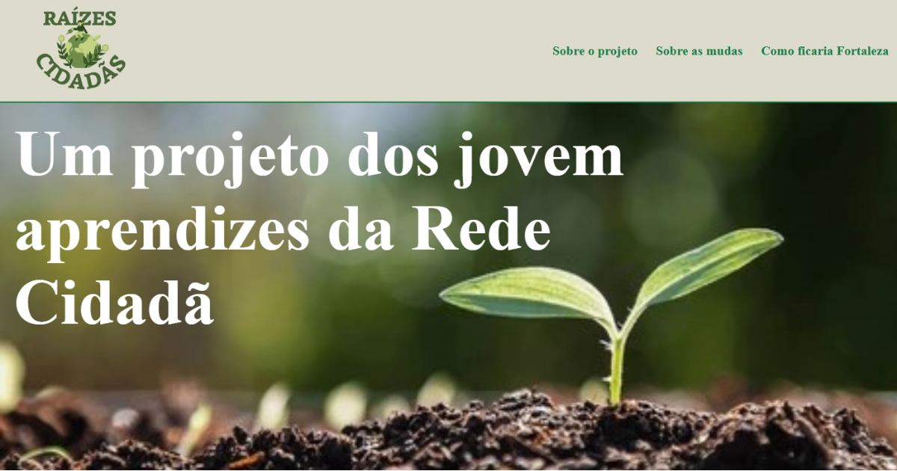

# 🌱 Raízes Cidadãs

Site criado como parte da iniciativa **Raízes Cidadãs**, que conquistou o segundo lugar no projeto **JAS (Jovem Aprendiz Sustentável)**. 

Seu objetivo é promover a conscientização ambiental e o engajamento da comunidade por meio da divulgação de ações sustentáveis.

---

## 📸 Visão Geral

O projeto apresenta páginas com informações gerais sobre iniciativa, foto e informações sobre as mudas que podem ser adquiridas e imagens de como estão alguns bairros agora e como podem ficar com a ajuda da iniciativa.  

É um site simples e direto, com foco em ser informativo, acessível e em gerar impacto visual.

---

## 🛠️ Tecnologias Utilizadas

- **HTML** – estrutura das páginas  
- **CSS** – estilização visual   
- **JavaScript** – utilizado de forma interna no HTML para a funcionalidade do menu nas telas de celulares e para o antes e depois da página _Como ficaria Fortaleza_  
- **Inteligência Artificial** - usado na criação das fotos de "depois" da página _Como ficaria Fortaleza_ 

---

## 📄 Estrutura do Projeto

- `index.html` – página principal  
- `fotos.html` – fotos do possível "antes e depois" da iniciativa  
- `mudas.html` – informações sobre as mudas que podem ser adquiridas  
- `style.css` – estilos aplicados ao site  
- `img/` – pasta com imagens utilizadas  
- `LICENSE` – licença MIT

---

## 🚀 Como Visualizar

Você pode abrir o projeto diretamente no navegador:

```bash
# Clone o repositório
git clone https://github.com/jessicacristinass/RaizesCidadas

# Acesse a pasta e abra o arquivo index.html
```

Ou acesse a versão publicada no GitHub Pages:  
[🔗 jessicacristinass.github.io/RaizesCidadas](https://jessicacristinass.github.io/RaizesCidadas/)
